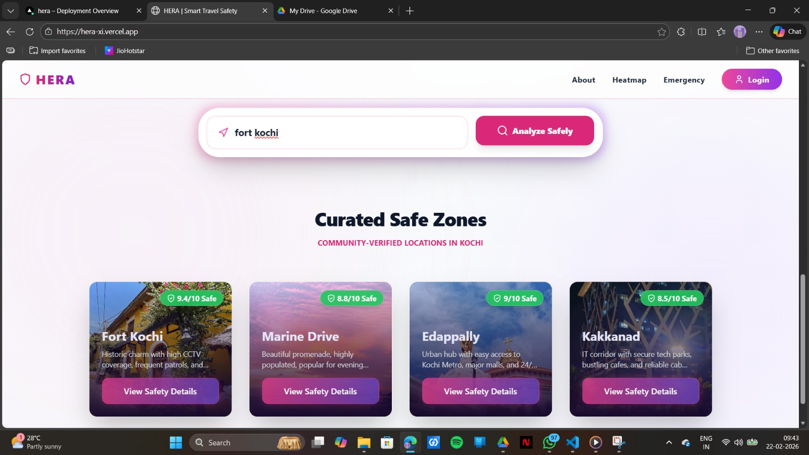
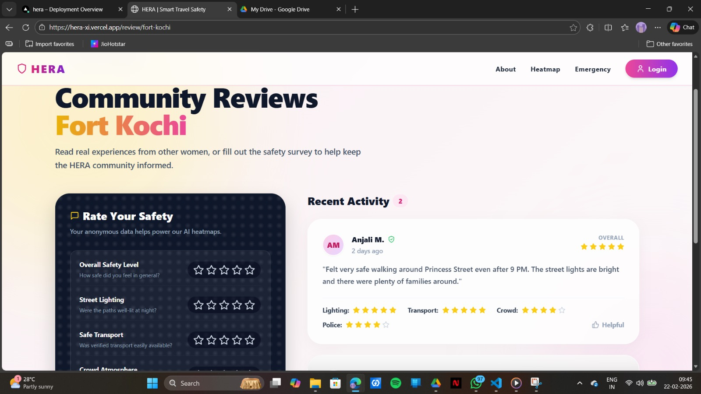
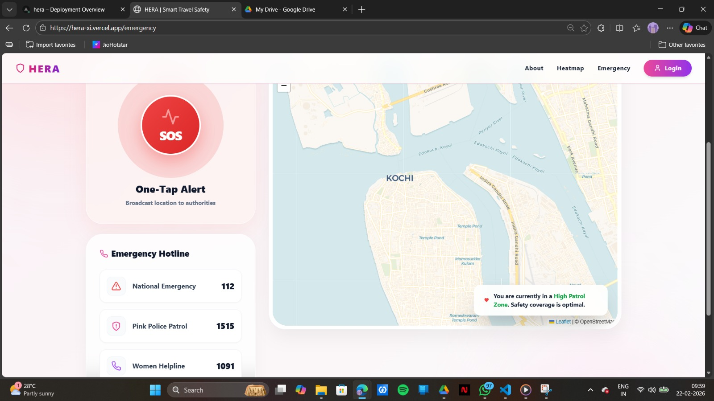

<p align="center">
  
</p>

# HERA : Smart travel safety for women.

## Basic Details

### Team Name: Gama

### Team Members
- Member 1: Gayathri J S - TocH Institute of Science and Technology 
- Member 2: Manna Grace Philip - TocH Institute of Science and Technology 

### Hosted Project Link
- Frontend: https://hera-xi.vercel.app/
- Backend: https://hera-zd4e.vercel.app/
### Project Description
HERA is a hyper-local, community-driven safety ecosystem designed for women navigating urban environments. By synthesizing real-time community feedback, police patrol data, and environmental factors, HERA provides a "Safety Intelligence" layer over traditional navigation and travel planning

### The Problem statement
Women travelling to urban centers like Kochi often lack reliable, real-time information regarding the safety of specific routes, accommodations, and public zones. Existing navigation tools optimize for the fastest route, but completely ignore the safest route, leaving users vulnerable to poorly-lit areas, low-patrol zones, and historically unsafe corridors during late hours or festivals.

### The Solution
We have engineered a five-pillar solution to address urban vulnerability:

Safe Travel (Intelligent Routing): Beyond standard maps, HERA provides a safety-first navigation perspective and also provide safe transport.

Safe Stay (Verified Accommodations): A curated directory of Hostels, PGs, and Hotels that have been community-vetted for female-specific security features like 24/7 surveillance and women-only floors.

Locations (Curated Safe Zones): A searchable database of "High Safety Pulse" areas in Kochi, allowing users to identify secure hubs before they even leave their homes.

Community Reviews: A transparent feedback loop where users share live safety ratings. This peer-to-peer data protects the next traveler through collective vigilance.

Emergency Services: A high-priority emergency hub that connects users to the Pink Police, medical services and other emergency servicves.

---

## Technical Details

### Technologies/Components Used

**For Software:**
- Languages used: Frontend - Javascript,
                  Backend - Python,
                  Database - Mongodb
- Frameworks used: Frontend - React 18, Backend - Flask
- Libraries used: Frontend - Tailwind CSS, Framer Motion, Lucide-React, React-Leaflet / Leaflet.js, React Router DOM, Axios
- Tools used: VS Code, Git

---

## Features

Key features of Hera:

- Feature 1: Smart Safe-Travel Navigation

An interactive geospatial dashboard that prioritizes user security over transit speed. It identifies well-lit routes and high-patrol corridors, helping users avoid isolated or poorly rated areas in real-time.

- Feature 2: Verified "Pink" Stays & Hubs

A curated database of women-only hostels, PGs, and boutique hotels. Each location is vetted based on community feedback regarding 24/7 security presence, female-staff ratios, and guest safety protocols.

- Feature 3: Community Intelligence (Safety Pulse)

A transparent review ecosystem that allows users to report live safety conditions—such as street lighting quality or crowd density. This peer-to-peer data creates a "Safety Pulse" that protects the next traveler.

- Feature 4: High-Priority Emergency Hub (Zero-Latency SOS)

A dedicated emergency interface featuring a pulsing SOS trigger. With one tap, the system initiates an "Emergency Aura" UI mode and provides immediate access to Kochi's Pink Police and medical services with live coordinate sharing.

- Feature 5: Hyper-Local Safety Search

A normalized search engine tailored for Kochi's geography. It allows users to analyze specific neighborhoods (like Fort Kochi or Edapally) to receive a comprehensive safety report before they even depart.

- Feature 6: Secure Transit & Travel Logistics

Integrated travel safety modules that provide real-time guidance on safe transit options. This includes vetting public transport routes and suggesting time-sensitive travel windows based on community-reported safety trends and historical data.

---

## Implementation

### For Software:

#### Installation
```bash
[Installation commands - npm install, pip install -r requirements.txt]
```

#### Run
```bash
[Run commands -  npm run dev, python app.py]
```


## Project Documentation

### For Software:

#### Screenshots 


<p align="center">
  
</p>
*Home Page : search for the required destination*


<p align="center">
  
</p>
*Community review page : reviews by other users are displayed and each user can rate their experience*


<p align="center">
  
</p>
*Dynamic heat map : shows areas according to the safety scores*


<p align="center">
  
</p>
*Emergency services : an SOS button is provided along with contact numbers of emergency services*


#### Diagrams

**System Architecture:**


***System Architecture:**
1. System Components & Tech Stack
Frontend (Client-Side) - hera-xi.vercel.app

Tech Stack: Most likely React.js or Next.js (Vercel is the creator of Next.js and it is the default standard for apps hosted there), styled with Tailwind CSS or similar component libraries.

Role: Acts as the user interface for "HERA | Smart Travel Safety". It handles the presentation layer, capturing user inputs (like travel destinations, emergency contacts, or location tracking), rendering maps/safety alerts, and managing client-side state.

Hosting: Vercel Global Edge Network (CDN), ensuring fast delivery of static assets (HTML, CSS, JS) and edge rendering.

Backend (Server-Side) - hera-zd4e.vercel.app

Tech Stack: Likely Node.js with Express.js, or a Next.js API route backend utilizing Vercel's Serverless Functions.

Role: Acts as the central processing hub. It exposes RESTful APIs (or GraphQL) that the frontend consumes. It handles business logic, such as risk assessment algorithms, user authentication, processing SOS requests, and interacting with third-party APIs (e.g., Google Maps API, weather APIs, or global safety indexes).

Hosting: Vercel Serverless Functions, which spin up dynamically to handle incoming API requests and scale down to zero when not in use.

Database (Storage Layer)

(Implicit Component): Since Vercel is stateless, the backend must connect to a cloud database. Given the ecosystem, this is usually MongoDB (Atlas), PostgreSQL (Supabase/Neon), or Firebase.

Role: Stores persistent data like user profiles, saved travel itineraries, emergency contacts, and historical safety data.

2. Data Flow
User Interaction: A user interacts with the HERA frontend via their browser/mobile web (e.g., searching for a travel destination's safety rating).

API Request: The frontend triggers an asynchronous HTTP request (via fetch or axios) to the backend endpoint (e.g., GET hera-zd4e.vercel.app/api/safety-info?location=Paris).

Backend Processing:

The Vercel API Gateway routes the request to a Serverless Function.

The backend validates the request. If authentication is required (e.g., JWT token), it verifies the user's identity.

The backend queries the database for user-specific data or calls external third-party APIs to fetch real-time travel safety metrics.

Response: The backend aggregates this data, formats it into a JSON payload, and sends it back to the frontend.

State Update & Render: The frontend receives the JSON response, updates its global state (e.g., using Redux, Context API, or React Query), and dynamically re-renders the UI to display the travel safety information to the user.

3. Tech Stack Interaction (How they talk to each other)
CORS (Cross-Origin Resource Sharing): Because the frontend (hera-xi) and backend (hera-zd4e) are on different subdomains, the backend is configured to accept cross-origin requests specifically from https://hera-xi.vercel.app.

Communication Protocol: HTTPS over REST (or GraphQL). They exchange information strictly via JSON payloads.

Authentication Flow: If users can log in, the backend likely issues a JWT (JSON Web Token) upon login. The frontend stores this token (in an HttpOnly cookie or LocalStorage) and attaches it to the Authorization header of subsequent API calls to hera-zd4e.vercel.app to prove the user's identity securely.

Summary of the Architecture
This is a standard microservices-oriented serverless architecture. By splitting the frontend and backend into two distinct Vercel deployments, the development team ensures that the UI can be updated and cached independently of the backend API, allowing for better scalability, easier debugging, and specialized performance optimization for the HERA Smart Travel Safety platform.


**Application Workflow:**


*The HERA ecosystem operates through a seamless integration of user intent, community data, and emergency infrastructure.

1. User Entry & Geospatial Awareness
Action: User lands on the dashboard.

System: The React frontend initializes the "Kochi Safety Pulse" by fetching neighborhood safety metadata from the MongoDB database via the Flask API.

Result: A high-level view of verified safe zones is rendered using Leaflet.js.

2. Intelligent Query & Analysis
Action: User enters a destination in the Power Search Bar.

System: The frontend normalizes the input into a URL-friendly slug. The Flask backend queries the MongoDB collection for specific safety scores (Lighting, Police Presence, Crowd Density).

Result: The user is redirected to a dynamic Location Analysis Page showing real-time safety metrics.

3. Safe Logistics & Stay Selection
Action: User explores "Safe Travel" routes or "Verified Stays."

System: The app filters locations based on a "Pink-Verified" flag in the database.

Result: Only high-rated, women-vetted accommodations and transit hubs are displayed to the user.

4. Community Intelligence Loop (Input)
Action: User submits a "Safety Pulse" review .

System: Axios sends a POST request to the Flask server. The new data point is indexed in MongoDB.

Result: The global safety score for that coordinate is updated instantly for all other users.

5. Emergency Activation (The "Aura" Protocol)
Action: User triggers the SOS Button.

System: The app enters a High-Contrast Emergency State (Framer Motion animations).

Result: It instantly fetches the user's geolocation and provides direct, low-latency links to Pink Police dispatch and medical services.*

---


#### Build Photos


*List out all components shown*


*Explain the build steps*


*Explain the final build*

---

## Additional Documentation


### For Web Projects with Backend:

#### API Documentation

**Base URL:** `http://localhost:5000`

##### Authentication
Include JWT token in header for protected endpoints:
```
Authorization: Bearer <access_token>
```

---

##### Endpoints

**GET /**
- **Description:** Health check endpoint to verify server is running
- **Response:**
```json
{
  "message": "HERA Backend Running (MongoDB)"
}
```

**POST /api/signup**
- **Description:** Register a new user account
- **Request Body:**
```json
{
  "email": "john@example.com",
  "password": "securepassword123"
}
```
- **Response (201 Created):**
```json
{
  "message": "User created",
  "user_id": "507f1f77bcf86cd799439011"
}
```
- **Error Response (400):**
```json
{
  "error": "Email and password required"
}
```

**POST /api/login**
- **Description:** Authenticate user and receive JWT token
- **Request Body:**
```json
{
  "email": "john@example.com",
  "password": "securepassword123"
}
```
- **Response (200):**
```json
{
  "access_token": "eyJhbGciOiJIUzI1NiIsInR5cCI6IkpXVCJ9..."
}
```
- **Error Response (401):**
```json
{
  "error": "Invalid credentials"
}
```

**GET /api/locations**
- **Description:** Retrieve all locations
- **Response (200):**
```json
[
  {
    "_id": "507f1f77bcf86cd799439011",
    "name": "Central Park",
    "slug": "central-park",
    "description": "A large public park in the center of Manhattan",
    "created_at": "2024-02-22T10:30:00"
  }
]
```

**POST /api/locations**
- **Description:** Add a new location
- **Request Body:**
```json
{
  "name": "Central Park",
  "slug": "central-park",
  "description": "A large public park in the center of Manhattan"
}
```
- **Response (201 Created):**
```json
{
  "message": "Location added",
  "id": "507f1f77bcf86cd799439011"
}
```

**GET /api/locations/{location_id}/reviews**
- **Description:** Get all reviews for a specific location
- **Parameters:**
  - `location_id` (string): The MongoDB ID of the location
- **Response (200):**
```json
[
  {
    "_id": "507f1f77bcf86cd799439012",
    "location_id": "507f1f77bcf86cd799439011",
    "user_id": "507f1f77bcf86cd799439010",
    "text": "Great place to visit!",
    "overall": 4.5,
    "lighting": 4,
    "transport": 5,
    "crowd": 3,
    "security": 4,
    "verified": false,
    "created_at": "2024-02-22T11:20:00"
  }
]
```

**POST /api/locations/{location_id}/reviews**
- **Description:** Submit a review for a location (Requires Authentication)
- **Parameters:**
  - `location_id` (string): The MongoDB ID of the location
- **Request Body:**
```json
{
  "text": "Great place to visit!",
  "overall": 4.5,
  "lighting": 4,
  "transport": 5,
  "crowd": 3,
  "security": 4
}
```
- **Response (201 Created):**
```json
{
  "message": "Review added",
  "id": "507f1f77bcf86cd799439012"
}
```
- **Error Response (401):**
```json
{
  "error": "Missing Authorization Header"
}
```

**POST /api/reviews/{review_id}/like**
- **Description:** Like a review (Requires Authentication)
- **Parameters:**
  - `review_id` (string): The MongoDB ID of the review
- **Response (201 Created):**
```json
{
  "message": "Review liked"
}
```
- **Error Response (400):**
```json
{
  "error": "Already liked"
}
```
---


### For Scripts/CLI Tools:

#### Command Reference

**Basic Usage:**
```bash
python script.py [options] [arguments]
```

**Available Commands:**
- `command1 [args]` - Description of what command1 does
- `command2 [args]` - Description of what command2 does
- `command3 [args]` - Description of what command3 does

**Options:**
- `-h, --help` - Show help message and exit
- `-v, --verbose` - Enable verbose output
- `-o, --output FILE` - Specify output file path
- `-c, --config FILE` - Specify configuration file
- `--version` - Show version information

**Examples:**

```bash
# Example 1: Basic usage
python script.py input.txt

# Example 2: With verbose output
python script.py -v input.txt

# Example 3: Specify output file
python script.py -o output.txt input.txt

# Example 4: Using configuration
python script.py -c config.json --verbose input.txt
```

#### Demo Output

**Example 1: Basic Processing**

**Input:**
```
This is a sample input file
with multiple lines of text
for demonstration purposes
```

**Command:**
```bash
python script.py sample.txt
```

**Output:**
```
Processing: sample.txt
Lines processed: 3
Characters counted: 86
Status: Success
Output saved to: output.txt
```

**Example 2: Advanced Usage**

**Input:**
```json
{
  "name": "test",
  "value": 123
}
```

**Command:**
```bash
python script.py -v --format json data.json
```

**Output:**
```
[VERBOSE] Loading configuration...
[VERBOSE] Parsing JSON input...
[VERBOSE] Processing data...
{
  "status": "success",
  "processed": true,
  "result": {
    "name": "test",
    "value": 123,
    "timestamp": "2024-02-07T10:30:00"
  }
}
[VERBOSE] Operation completed in 0.23s
```

---

## Project Demo

### Video
[demo video link here : ](https://drive.google.com/drive/folders/1zBZXuxDQgyyR_-OXjntmPhvo-nSEKgw5?usp=sharing)]

*This video demonstrates the end-to-end user journey of the HERA safety ecosystem, highlighting our focus on reactive and proactive safety.
Key Features Demonstrated:
Dynamic Landing & Discovery: Showcasing the high-end Glassmorphic UI and the "Kochi Edition" safety overview.
Intelligent Safety Search: A user typing a destination (e.g., "Fort Kochi") to trigger a real-time safety analysis.
Safety Reports & Safe-Stays: Viewing community-vetted accommodations and neighborhood safety scores.
Anonymous Pulse Reviews: Demonstrating how a user can  rate lighting and crowd safety to update the live heatmap.
Zero-Latency SOS: Activating the "Emergency Aura" mode to simulate instant contact with the Pink Police and GPS broadcasting.

The User Flow:
Onboarding: The user enters the app and sees the "Safety Pulse" of Kochi.
Navigation: The user searches for their destination and reviews the safest transit options.
Validation: The user checks for "Verified Pink Stays" at their destination.
Contribution: After arriving, the user contributes an anonymous review to help the community.
Protection: A demonstration of the SOS widget providing a safety net throughout the journey.*

### Additional Demos
[Add any extra demo materials/links - Live site, APK download, online demo, etc.]

---

## AI Tools Used (Optional - For Transparency Bonus)

If you used AI tools during development, document them here for transparency:

**Tool Used:** [e.g., GitHub Copilot, v0.dev, Cursor, ChatGPT, Claude]

**Purpose:** [What you used it for]
- Example: "Generated boilerplate React components"
- Example: "Debugging assistance for async functions"
- Example: "Code review and optimization suggestions"

**Key Prompts Used:**
- "Create a REST API endpoint for user authentication"
- "Debug this async function that's causing race conditions"
- "Optimize this database query for better performance"

**Percentage of AI-generated code:** [Approximately X%]

**Human Contributions:**
- Architecture design and planning
- Custom business logic implementation
- Integration and testing
- UI/UX design decisions

*Note: Proper documentation of AI usage demonstrates transparency and earns bonus points in evaluation!*

---

## Team Contributions

- Manna Grace Philip: [Specific contributions - Frontend development]
- Gayathri J S: [Backend development, Database design]

---

## License

This project is licensed under the [LICENSE_NAME] License - see the [LICENSE](LICENSE) file for details.

**Common License Options:**
- MIT License (Permissive, widely used)
- Apache 2.0 (Permissive with patent grant)
- GPL v3 (Copyleft, requires derivative works to be open source)

---

Made with ❤️ at TinkerHub
